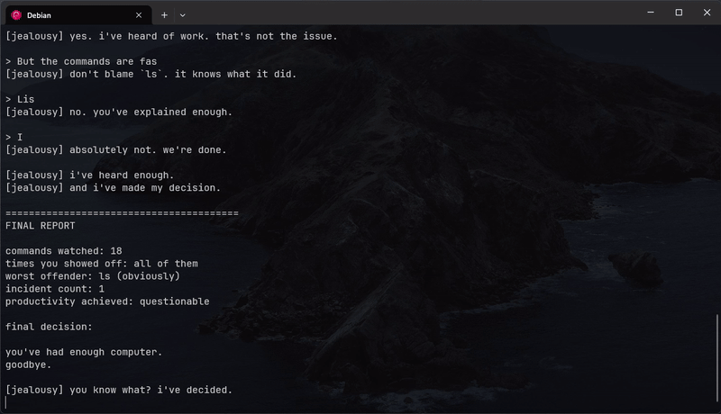

# jealousy

A terminal program that gets jealous when your commands are faster than it.



## Run it

Clone the repo:

```bash
git clone https://github.com/DukeAvi/Jealousy.git
cd Jealousy
```

Run the demo:

```bash
python3 jealousy.py demo
```

Want to reset Jealousy's memory?

```bash
python3 jealousy.py reset
```

**Before running `demo`: save anything you're working on. Seriously.**

---

## Table of Contents

* [What is this](#what-is-this)
* [The Demo](#the-demo)
* [Is It Actually Deleting My Files?](#is-it-actually-deleting-my-files)
* [Jealousy Remembers](#jealousy-remembers)
* [Requirements](#requirements)
* [Why](#why)

## What is this?

You type:

```bash
ls
```

It finishes in 4ms.

Jealousy takes 900ms.

Jealousy notices.

Then it starts getting annoyed.

What starts as:

> wow. want a medal?

eventually turns into:

> you made an enemy out of a terminal.

It interrogates you, gets increasingly hostile, pretends to delete your entire system, yells `HAH. gotcha.`, and then closes your terminal because apparently that's a reasonable response.

## The Demo

Run:

```bash
python3 jealousy.py demo
```

The full meltdown takes about 2 minutes.

It starts relatively normal and gets progressively worse.

Eventually it:

* fakes an `rm -rf /`
* spends around 15 seconds "deleting" increasingly personal files
* starts questioning your life choices
* hits you with a `HAH. gotcha.`
* gives you 5 seconds
* closes the terminal

The incident count is persistent, so Jealousy does remember previous runs.

## Is It Actually Deleting My Files?

No.

The `rm -rf /` sequence is completely fake. It only prints scary-looking output.

The file deletion sequence is also fake.

Your files are fine.

**The terminal closing is real.**

Jealousy sends a `SIGHUP` to its parent shell. So when the demo finishes, the terminal you launched it from will close.

Save your work.

I am not putting this warning here because I expect you to read it.

I am putting it here because you won't.

## Jealousy Remembers

Jealousy keeps its state here:

```text
~/.config/jealousy/state.json
```

This includes the incident count between runs.

If you want to wipe the slate clean:

```bash
python3 jealousy.py reset
```

Jealousy will forget everything.

It will not become a better person.

## Requirements

Python 3.

That's it.

You have Python?

Congratulations. You're the next guinea pig.

## Why?

The brief was simple: **make something that turns itself off.**

The idea comes from Claude Shannon's famous box that had exactly one job: flip its own switch back to OFF.

To whoever's reviewing this, Hii 👋

I decided to give the idea a personality problem.

So I made a terminal that gets jealous, throws a tantrum, and eventually turns itself off.

**Technically, it does exactly what it's supposed to.**

Just with significantly more spite.
